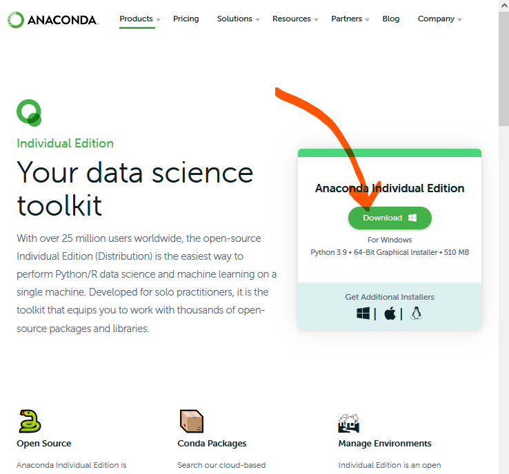
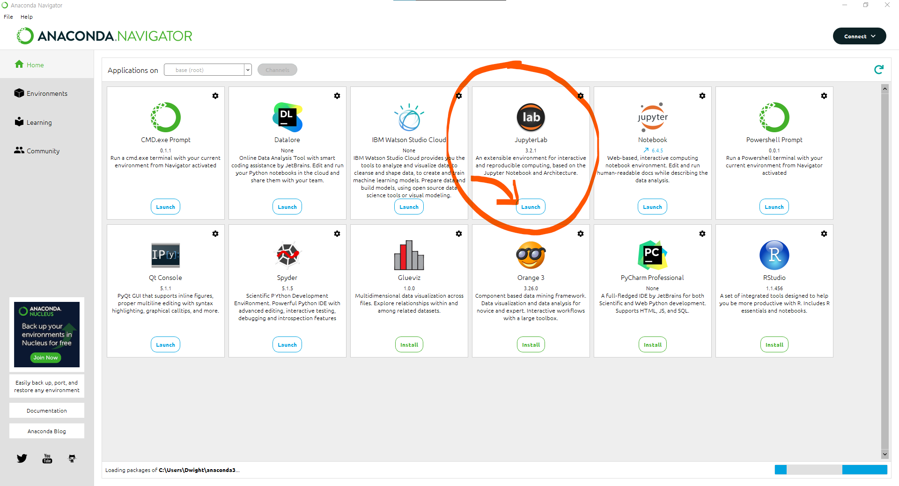
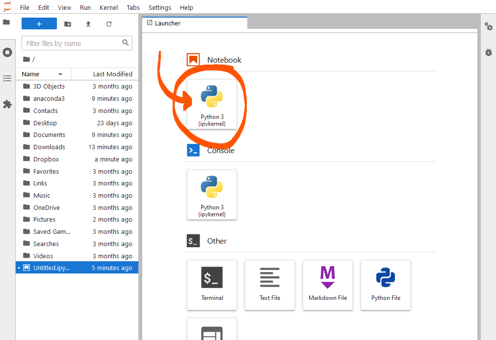
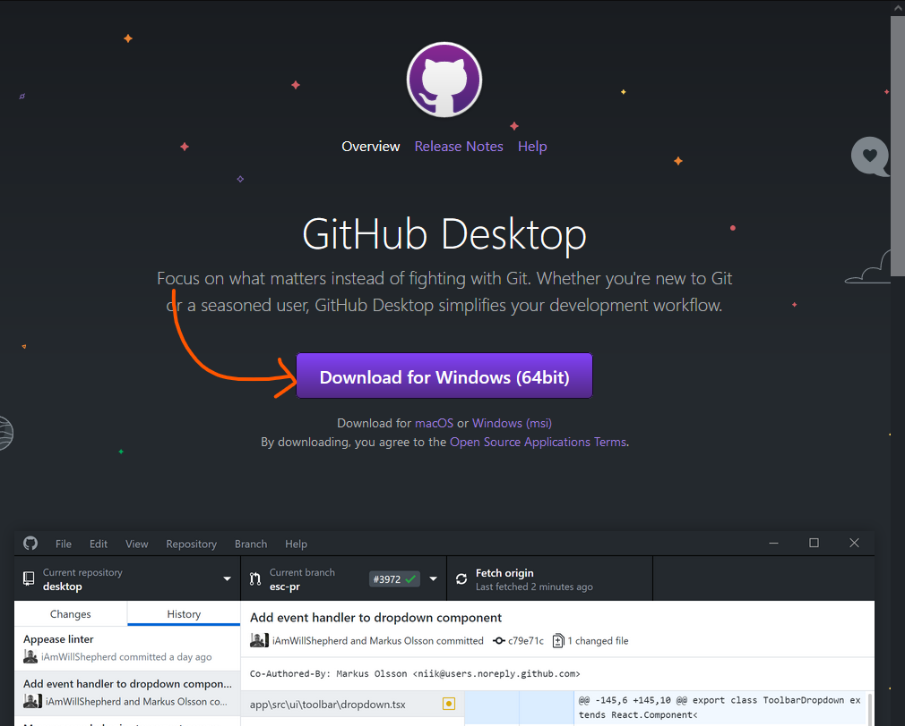
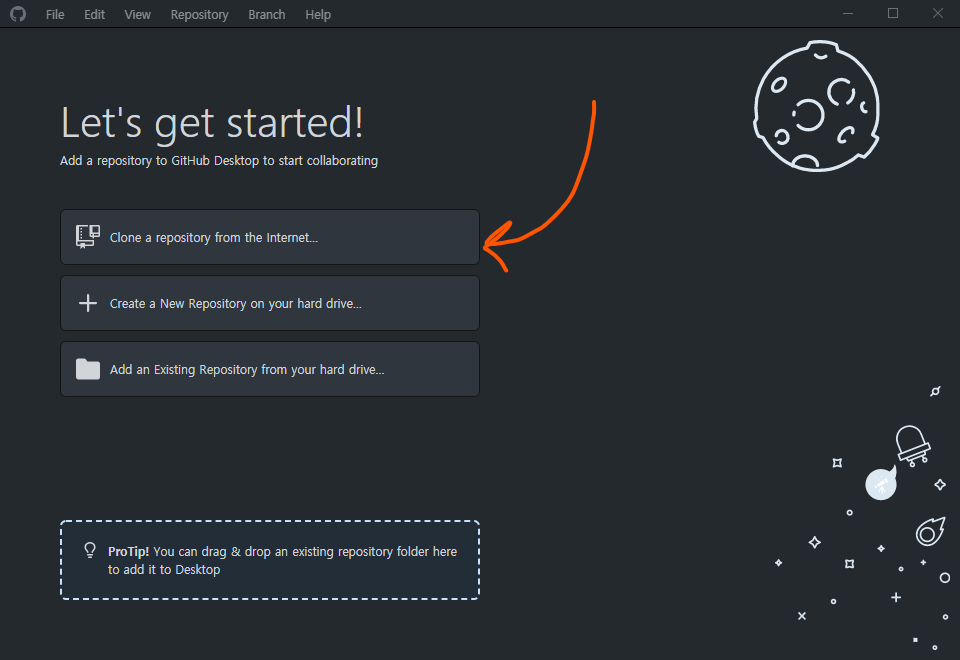
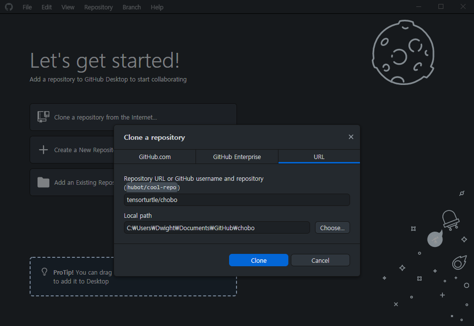
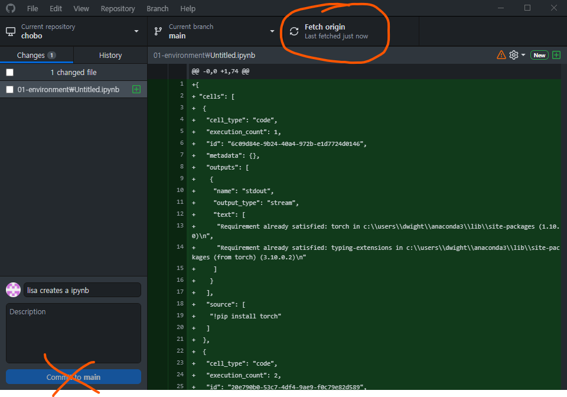

# Chapter 1: 개발환경 셋업

## Windows에서 Jupyter Lab 설치

[www.anaconda.com](https://www.anaconda.com/products/individual)







## GitHub에서 자료 다운받기 

[desktop.github.com](https://desktop.github.com)









## 진도 리뷰 

이제 파이썬 & 파이토치로 딥러닝을 배우고 응용할 아주 최소한의 셋업이 완성되었습니다. 

Jupyter Lab은 내부적으로 이런 구조를 가지고 있습니다:

```
┌─────────────┐
│웹 브라우저    │
│             │
│             │
│내 앞에 보이는  │
│개발 환경      │
└──────▲──────┘
       │localhost 또는 인터넷 연결
┌──────┴──────┐
│ 웹 서버      │
└──────▲──────┘
       │
┌──────┴──────┐
│Python Kernel│
│             │
│코드가 실제로   │
│돌아가는 곳    │
└─────────────┘
```

우리가 위에서 만든 셋업은 이 세 단계를 다 내 컴퓨터 안에서 (localhost)에서 실행했습니다.

다시말해서, 내 컴퓨터에서 코드를 돌리고, 내부적인 웹서버를 작동시켜서, 내 컴퓨터의 웹 브라우저에서 결과를 봅니다.

그런데, 이렇게 다 한 곳에서 할 필요는 없다는 말이죠.

예를 들어, [Google Colab](https://colab.research.google.com/)을 열어보면,
익숙한 Jupyter Notebook 형식의 인터페이스가 있지만,
내가 실행하는 코드는 내 컴퓨터가 아닌 구글의 서버에서 돌아갑니다.

비슷한 서비스는 많습니다
+ [Paperspace Gradient](https://gradient.run/)
+ [Deepnote](https://deepnote.com/dashboard)

만약 내가 NVIDIA GPU가 장착된 컴퓨터를 소유하고 있다면, 나만의 서버를 만들어서 원격으로 접속할수 있습니다.

GPU가 장착된 컴퓨터 (리눅스) 에서
```
jupyter lab --no-browser --port=8888
```
이라고 치고, 라우터 세팅으로 8888번 포트 포워딩을 세팅해놓으면, 다른 컴퓨터에서

```
ssh -p [외부 포트 포워딩 포트 번호] -NfL localhost:8888:localhost:8888 [GPU컴퓨터사용자이름]@[GPU컴퓨터IP주소]
```
를 치고, 웹 브라우저에서 `localhost:8888` 로 가면 GPU를 GPU가 없는 컴퓨터에서도 사용할 수 있습니다.


## GPU 활용 가능한 Jupyter Notebook 셋업하기


여기서 부터는 `.ipynb` 확장자를 가진 Jupyter Notebook파일을 통해 학습을 진행합니다.

[다음 주제 (파이토치와 GPU) 가기](about-gpu.ipynb)