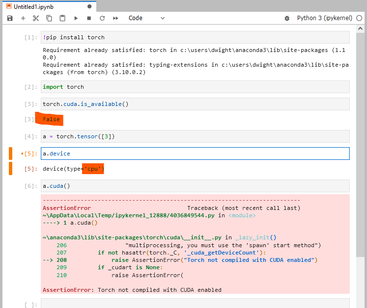

# Chapter 1: 개발환경 셋업

## Windows에서 Jupyter Lab 설치

[www.anaconda.com](https://www.anaconda.com/products/individual)


## GitHub에서 자료 다운받기 

[desktop.github.com](https://desktop.github.com)


**"Local Path"에 보이는 위치에 내용이 다운로드 됩니다. Jupyter Lab에서 왼쪽 탐색기로 그 위치로 찾아 가세요.**


## 진도 리뷰 

이제 파이썬 & 파이토치로 딥러닝을 배우고 응용할 아주 최소한의 셋업이 완성되었습니다. 


그러나, 이 환경에서는 GPU 활용을 못합니다. (CPU대비 10배 이상 성능 차이)

### GPU 활용 개념 잡기 

파이토치는 기본적으로 새로운 텐서 (추가적인 기능이 있는 숫자 데이터 형식) 를 시스템 RAM에 생성하고, CPU 로 연산을 수행합니다.

그러나, 특별히 GPU를 사용할 경우, 텐서 데이터는 CPU에 연결된 RAM대신, GPU 전용 VRAM에 저장되고, 연산은 CPU대신 GPU에서 실행하게됩니다.

**CPU,GPU 관련 상대 속도 개요:**

```
┌───────────┐            ┌───────────┐
│    CPU    │ ─────────► │    GPU    │
│   느리지만  │ 느린 전송    │ 빠르지만    │
│다양한 연산   │ ◄──────── │ 특수 연산만  │
└────┬─▲────┘            └────┬─▲────┘
     │ │ 빠른 전송              │ │ 아주 빠른 전송
  ┌──▼─┴──┐                ┌──▼─┴───┐
  │  RAM  │                │  VRAM  │
  │       │                │        │
  └───────┘                └────────┘
```

이 diagram 의 상세 부분은 다음 시간에 알아보도록 하겠습니다.

**Jupyter Lab 에서 GPU를사용 못할 경우:**



**GPU 사용 가능할 경우**

`!nvidia-smi` shell command를 통해 설치된 GPU 


